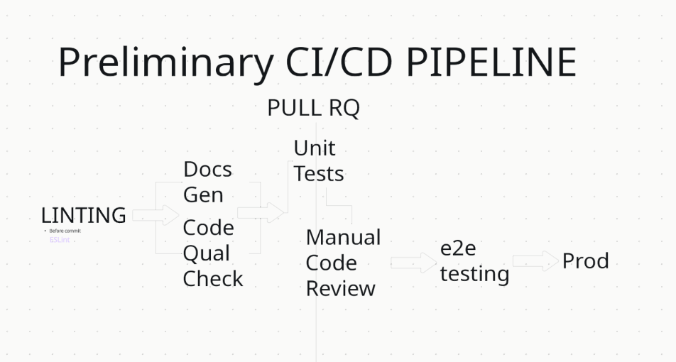

# CI/CD Pipeline
> Last Updated: 11/17/2024, Sprint 1

## 1. Goal
- Our goal is to automate the testing and deployement through GitHub Actions. The above is our planned CI/CD pipeline.
- In CI, we planned to use:
    1. ESLint (Github Actions has builtin support), checks for linting
    2. HTML Validator (Through [html5validator](https://github.com/marketplace/actions/html5-validator)), validate HTML and CSS files
    3. Jest for unit testing
- In CD, we planned to use:
    1. GitHub Pages. Since our project is relatively small and most code can be excuted in Javascript, we decided not to have a backend. We will host our website directly on GitHub Pages, which is safe and easy.
    2. JS Docs (Through [jsdoc-action](https://github.com/marketplace/actions/jsdoc-action)) that will generate the documentations
- For code quality check, we will do a peer review for each merge request to main. At least 1 reviewer is required before a pull request gets merged
- The pull request to main will also require the above CI checks to pass.

## 2. Current
- As of this sprint, we decided just to add HTML validator and GitHub Pages deploy.
- The HTML validator will check on every push to `playground` branch. And GitHub Pages will also be build on this branch.
- The reasons are as follows:
    1. We want it to test CI/CD before it runs on main
    2. We want to iteratively add more CI as making CI perfect is not the main goal of this sprint. Thus, only two actions are running now.
    3. The need for CI and CD may change later. We should build the pipeline little by little.
- For code quality checks, a branch protect rule was deployed to main branch to ensure the code quality check before merging.